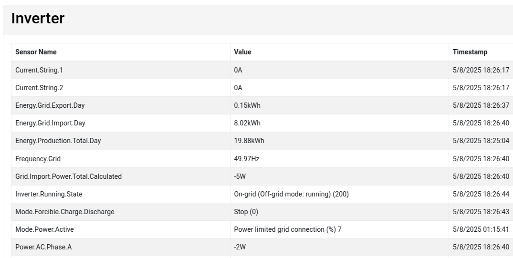
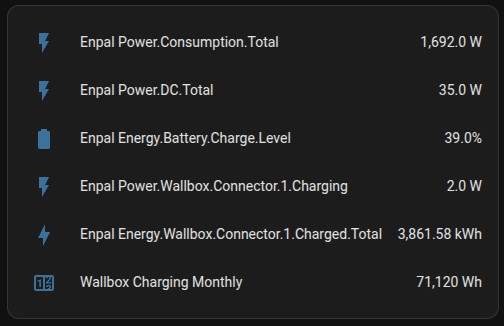
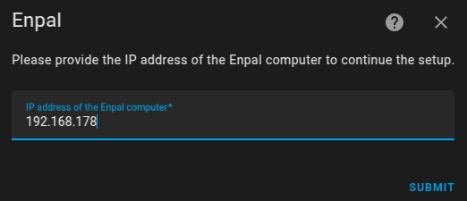

#  Enpal - Home Assistant integration (WiP)

## Disclaimer

This integration is created with acknowledgement and limited support from Enpal GmbH, but __it's not official software from Enpal__. 
It's a custom integration created entirely by me (Skipperro), and thus Enpal GmbH is not responsible for any damage/issues caused by this integration, nor it offers any end-user support for it.

It is still a work in progress and is not guaranteed to work 100% or even work at all. 

## Braking changes in 0.4.0 

> [!WARNING]  
> Version 0.4.0 of this integration is no longer using InfluxDB connection and doesn't require access token from Enpal.
> Instead it's based on pure HTML scraping of the Enpal web interface. 
> This means that the integration is now more reliable and doesn't require any special access to the Enpal system or periodic support tickets to get a new token.
> 
> The downside is, that it's no longer compatible with the previous versions of the integration, and you will need to remove the old integration and install the new one.

## How it works

During the setup you will need to provide IP of the Enpal Box for your installation. The device should be connected to your LAN/WiFi network, so you should be able to get the IP from your router or by scanning the network for devices with web interface.

The integration will then scrape the data from the Enpal Box web interface ([IP]/deviceMessages) and provide it to Home Assistant as a set of sensors. Each row on the table will be represented as a sensor. 

Whenever possible, numerical values will be kept as numbers and the measurement units will also be passed to Home Assistant, so history graphs will be displayed correctly.
If conversion to number is not possible, the value will be passed as a string, for example for inverter serial number or operation modes.

## Installation

1. Install this integration with HACS (adding repository required), or copy the contents of this
repository into the `custom_components/enpal` directory.
2. Restart Home Assistant.
3. Start the configuration flow:
   - 
   - Or: Go to `Configuration` -> `Integrations` and click the `+ Add Integration`. Select `Enpal` from the list.
   - If the integration is not found try to refresh the HA page without using cache (Ctrl+F5).
4. Input the IP, Port and access token for access InfluxDB server of your Enpal solar installation.

